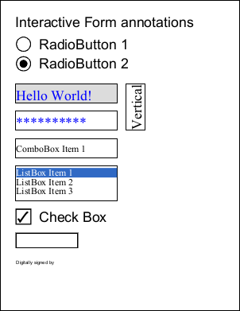
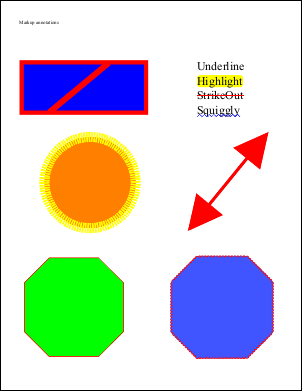
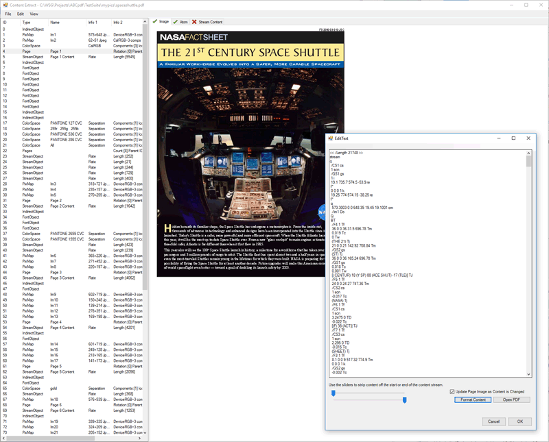

<h1>ABCpdf .NET Official Example Projects</h1>
  <h2>ABCpdf.Drawing Example Project</h2>
	
This is a project designed to parallel the System.Drawing namespace. 

	
For example, a System.Drawing.Pen will map to a WebSupergoo.ABCpdf14.Drawing.Pen and a System.Drawing.Bitmap will map to a WebSupergoo.ABCpdf14.Drawing.Bitmap.

	
Because the APIs and class structure are  very similar, it is easy to port System.Drawing code over to produce ABCpdf documents rather than System.Drawing images. 

	
In addition there are some ABCpdf extensions to allow support for advanced PDF oriented features like CMYK color spaces.

	
For more details see the project or the System.Drawing Example section of the ABCpdf .NET documentation.

	<h2>ABCpdfView Example Project</h2>
	
This shows how to display and print PDF documents from a Windows Forms application. 

	
It provides features such as viewing at different sizes and resolutions. It allows you to print documents that you are viewing. It presents a simple way of editing items in a PDF document.

	
Probably the core value of this project is in the printing code. This shows how to use ABCpdf in conjunction with the .NET printing APIs to send a PDF document to a printer. 

	
There are a variety of approaches you can use for printing. For example you can export to XPS and then send that document direct to the spooler. However we have found that, as of 2019, the EMF based print process is still the most reliable method. XPS is a more sophisticated approach but relies on current hardware and up-to-date software which may not be available on all  systems.

	
The PDF editing capabilities are interesting in that they show how you can edit items within a PDF document. However they are relatively unsophisticated and should be regarded as a base rather than code you can use directly in your projects.

	<h2>AccessiblePDF Example Project</h2>
	
This project demonstrates how to tag a PDF and make it accessible. The methods used are based around Section 508 compliance and the PDF/UA standard. 

	
The basis of this project is the use of the AccessibilityOperation and the MakeAccessible method. You can read more about  these  and the types of information that is added, under the documentation for those methods.

	
However a one function method  can only ever achieve so much in the context of complicated and semantically ambiguous documents. For example the reading order of any complex document is likely to vary between people - there is no absolutely correct answer. ABCpdf will come up with a reasonable method but it may not be the one you want.

	
The AccessiblePDF project shows how to use  knowledge of your documents to take the base data and enhance it. It shows how to detect and insert structure based on your understanding   of the document and supports the following structure types.

	<ul>
	  <li>Headers and Footers</li>
	  <li>Tables</li>
	  <li>Lists</li>
	  <li>Sections</li>
	  <li>Artifacts</li>
	</ul>
	
It shows how to use the tags in a PDF document to detect and change content within it. This includes some code relevant to eSignLive signatures.

	
It contains code to show how to add content and tags to an already tagged document, merging these tags with the existing structure in the style of the base document.

	
Usefully it provides a method of extracting the tagged structure of any PDF document to an HTML-like format you can  easily examine.

	<h2>AdvancedGraphics Example Project</h2>
	
This project shows how to use ABCpdf to  write PDF drawing operators and content streams.

	
Writing drawing operators to a content stream represents a lower level approach than  the standard ABCpdf APIs. It provides a  sophisticated level of control but it is rather more complicated to  code.

	
It is probably more appropriate for more drawing based routines where you need paths, clips, fills, shades and blends. It is probably less appropriate for text which can be very complex when presented at a low level.

	
For more details see the project or the Advanced Graphics Example section of the ABCpdf .NET documentation.

	<h2>Annotations Example Project</h2>
	
This shows how to use ABCpdf to  create form fields and document annotations.

	
Form fields are similar to HTML fields and encompass similar structures such as text boxes, radio buttons, check boxes, list boxes, signatures and push buttons.

	
Annotations are interactive in the same way as form fields but they do not hold a value to be submitted. There are a very wide variety of annotations you can create and these include stamps, notes, highlights, lines, arrows, rectangles and 3D scenes. 

	
In particular this project shows how to create electronic signatures, how to sign them programmatically, how to check the validity of any signed signatures and how to use incremental updates to allow successive signings by a chain of people.

	
For more details see the project or the Fields, Markup and Movies Example section of the ABCpdf .NET documentation.

	
 

	<h2>PDFSurgeon Example Project</h2>
	
This is a wonderful tool which allows you to view and manipulate the content of PDF documents. So rather than an example project, this is more of a utility. You have the source so it is easy to adapt to your needs, however for most requirements it should be fine as-is.

	
This utility allows you to open a PDF and see the individual objects within it. It has a search function so you can search for all objects matching a particular structure or perhaps referencing another specific object. You can edit objects and then resave the document.

	
Indeed you can even decompress and edit a content stream for a particular page and see the changes to the rendered appearance in real time. As you type into the content stream, the rendered page changes.

	
For getting to know how PDF documents and content streams work, this is an invaluable tool.

	

	<h2>FontUnembedment Example Project</h2>
	
The project detailed here shows how to un-embed and re-embed fonts.

	
There is a certain amount of overlap between this project and existing classes within ABCpdf. For example the ReduceSizeOperation class provides a simple way to un-embed fonts, while the FontObject class provides methods for embedding, un-embedding and subsetting fonts.

	
However the FontUnembedment project provides more careful control over the process and may be preferable where this is required.

	<h2>GlobalSign Example Project</h2>
	
The GlobalSign example project shows how to sign and validate PDF digital signatures using the GlobalSign cloud signing service.

	
For a good backgrounder on PDF signatures see the web page <a href="https://www.websupergoo.com/abcpdf-pdf-digital-signatures.aspx">PDF Digital Signatures in C# &ndash; The Definitive Guide</a>.

	<h2>GetColors Example Project</h2>
	
This project   shows how to find the colors used in a document.

	
One has to be a little careful about this concept - these things are not as straightforward as they might appear.

	
For example in a shading pattern there may be only two colors but of course a shade involves a variety of colors between these two points. Similarly an image may contain only two colors but the process of resizing it for display at a particular resolution may result in the creation of additional intermediate colors. Indeed the particular intermediate colors used may vary dependent on the resolution. 

	
Likewise a page may reference a particular color, but for a variety of reasons, that color may not be displayed. For example it might be part of an object which is clipped, or it might be obscured by another item that is  drawn a bit later, or it might be referenced but never actually used in an object.

	
However, with those caveats, it is sometimes useful to be able to count and retrieve the colors that are referenced. This project shows how this can be done. It reads the document pages and keeps track of the colors and color spaces that are referenced in the content stream. Finally it displays the answer.

	
In addition to being useful  for counting colors, this project also provides a good example of how the OpAtom and ContentStreamOperation classes can be used to analyze a page content stream and graphic state. So if you are wanting to do low level analysis of page content, this is a good place to start.

	<h2>HTMLTables Example Project</h2>
	
The project detailed here shows how to create PDF tables based on an HTML type input.

	
There is a certain amount of overlap between this project, the WPFTables and the PDFTable Example project. All do similar things in slightly different ways.

	
This project is based on HTML style input rather than programmatic control or WPF.

	<h2>OCGLayers Example Project</h2>
	
The term OCG refers to Optional Content Groups. These are what most people would conceptualize  as visible layers (not to be confused with the Doc.Layer concept).

	
OCGs allow you to specify content that may be visible or invisible. As a user,   you can see the names of the OCGs that exist and you can turn them on or off to   see or hide the respective content.

	
It is a mistake to think of OCGs as pure layers, as the rules associated with   them can be quite sophisticated. Each content item on the page may be associated   with one or more nested visibility groups and it is only if all these groups are   visible that the content item is visible. While visibility groups are often OCGs   they can also be Optional Content Membership Dictionaries (OCMD items) - a   construct that determines visibility from a set of OCGs using a set of custom   written rules. So visibility can be complex and items with visibility may be   interleaved rather than conceptually part of a simple contiguous layer.

	
That said, it is quite common for simple OCG setups to mimic   simple contiguous layers as this is what most people require.

	
This project shows how to create   content with visibility determined using OCGs. It also includes more complex   examples detailing the use of nested OCGs and OCMDs. 

	
As well as creating layers   it also shows shows how to turn OCGs on and off, annotate the items on a page   based on the OCGs that they belong to and how to redact and delete invisible   items, removing any associated OCGs.

	<h2>PDFEnterpriseServices Example Project</h2>
	
Normally when you use ABCpdf, it operates in process as part of your application. 

	
In some situations it may be useful have it operate out of process. This provides a number of benefits.

	<ul>
	  <li>It allows your code to run in a completely different process from your web code thus isolating the two.</li>
	  <li>It allows you complete control over the user which your code runs as without impacting the security of your web code. All you do is change the user using the Component Services Administration Tool.</li>
	  <li>Because your web code and your ABCpdf code are operating in different address spaces there is more free space in each process.</li>
	  <li>You can tell your component package to shut itself down when it's not being used.</li>
	</ul>
	
The simplest way to do this is to use the .NET Enterprise Services structures. These have gone through a variety of  iterations - MFC, COM+ and currently .NET Enterprise Services. The names themselves are a bit of a misnomer. For example COM+ is not really COM plus something extra. COM is a way of calling functions in a DLL while COM+ is an architecture which can be used to host application services - two completely different things. Similarly .NET Enterprise Services is not entirely .NET as it relies on COM concepts for implementation.

	
A lot of what you can read on the internet states that .NET Enterprise Services is legacy. There is some truth in this as the architecture is based around technologies created many years ago. However the reality is that these technologies are still very much in use because the  .NET equivalents are not that wonderful. The closest that exists is probably Windows Communication Foundation (WCF) but this is vastly complicated and  difficult to control; cryptic config files and do-or-die options. The .NET Enterprise Services equivalent involves opening up the Component Services control panel, checking a few boxes and then watch the cabbages (your objects) spin. A bit of legacy yes, but also a whole lot of mature.

	
The PDFEnterpriseServices example project under the ABCpdf .NET menu item shows you how to set up a .NET Enterprise Services Component  for converting HTML into PDF. This is relevant only for the MSHTML engine as both the ABCGecko and ABCChrome engines already operate out of process.

	<h2>PDFSurgeon Example Project</h2>
	
PDFSurgeon is a .NET Windows Forms application designed for inspecting and modifying the contents of PDF files. It serves both as a sample project and a practical utility - with the source code provided, you can easily customize it to fit specific needs, though it should meet most requirements out of the box.

	
After opening a PDF, you can explore its internal objects individually. A built-in search feature lets you locate all objects that match a given structure or reference another specific object. You can edit objects and save the document back to disk.

	
A standout capability is the ability to decompress and directly edit the page content stream with the rendered appearance updating live as you type. This real-time feedback makes it an invaluable tool for understanding how PDF documents and their content streams work.

	<h2>PDFTable Example Project</h2>
	
The project detailed here shows how to create PDF tables based on programmatic control.

	
There is a certain amount of overlap between this project, the WPFTables and the HTMLTables Example project. All do similar things in slightly different ways.

	
This project is based on programmatic control rather than HTML style input or WPF.

	
You can read more about how to use this project in the Small Table Example and Large Table Example sections of the ABCpdf .NET documentation.

	<h2>Print Example Project</h2>
	
This project demonstrates our preferred method of printing documents using ABCpdf under .NET.

	
There are a variety of ways that printing can be implemented under .NET. For example:

	<ul>
	  <li>Via the Windows Printing APIs</li>
	  <li>Via the .NET Printing APIs</li>
	  <li>Via XPS</li>
	</ul>
	
In addition some printers may support direct printing of certain formats. For example,

	<ul>
	  <li>PostScript</li>
	  <li>Printer Control Language (PCL)</li>
	  <li>PDF</li>
	  <li>XPS</li>
	</ul>
	
Our experience is that the Printing APIs provide the most reliable route. However we also find that there can be a significant overhead using the .NET APIs as opposed to the native ones. This seems to be printer dependent but can change the speed by an order of magnitude.

	
As such we feel that the fastest and most reliable printing method is via the Windows Printing APIs. However if you prefer to use the .NET Printing APIs you can find example code in the ABCpdfView example project.

	<h2>Redaction Example Project</h2>
	
The project detailed here shows how to redact or delete text and images from a document.

	
The code uses a variety of criteria to determine the items to be redacted. The most obvious one is an area of interest. As such, we have examples showing how to  redact  text or images in a particular area on a page.

	
However other criteria are also possible. Other examples show delete specific words from a document or how to select and delete text based on  text font and styling.

	<h2>ReferenceXObject Example Project</h2>
	
The project detailed here shows how to convert images to Reference XObjects.

	
In most cases a PDF document contains the images it wants to display. That way you have one package - the PDF document - which contains everything it needs.

	
However sometimes it can be advantageous to hold images externally, much like as happens in HTML. This way you can swap one image out for another and you keep the base template document the same.

	
This project shows how to take a PDF document and convert it into a base template referencing separate external image documents.

	<h2>SwfExport Example Project</h2>
	
Flash (SWF) export can be both simple or sophisticated based on your needs.

	
At the simplest all you need to do is Doc.Save your document as SWF.

	
However the SWF content really needs to exist in the context of a controller. This example shows how you can use your own template to provide navigation and information functions.

	
It shows how to wrap the output in a package which might look like a book or a brochure or perhaps a slide show.

	<h2>TaggedPDF Example Project</h2>
	
PDF documents can contain tags to indicate semantic structure.

	
This example shows how to create tagged documents using a low level approach.

	
It takes content specified as XML and converts it to content and associated tags.

	<h2>ValidatePDF Example Project</h2>
	
The Elements namespace allows structured access to the PDF Objects that exist.

	
As part of this structure it is possible to validate each of the objects in a document to ensure that they conform to the PDF Specification.

	
The validation covers the properties that each object may contain, the values that each property may take and the version of the PDF specification that is required for these properties to be valid.

	
This project shows how to use the Elements namespace to validate documents and report any information or irregularities.

	<h2>Viewer3D Example Project</h2>
	
The Viewer3D project contains a control for interactive viewing of 3D objects in PDF documents.

	
It supports the PDF 3D standards - U3D and PRC. So by extracting this information from your documents you can then view your 3D models.

	
This project includes the 3D control inside an application wrapper so you can easily see what it can do.

	<h2>WebPageSnapshot Example Project</h2>
	
One of the most common operations that people want to perform is to take a PDF snapshot of the current page.

	
However this can be more complicated than one might imagine in the case of a personalized page. The page your user is seeing exists only for them. ABCpdf may know the URL of the page but it lives on the server and it is not your client - it has its own page. You can attempt to mimic the client by copying cookies or security tokens but this is fraught with difficulty as it may look like some kind of spoofing attempt. Just because you know the operation is valid does not mean your server will think it is.

	
This project demonstrates how to use an alternative and more robust approach to creating such a page snapshot. It intercepts the HTML which was passed to the client and then treats that as a separate page. It is simple and fast and it is good for situations involving authentication and security. It makes use of privileges it already has by virtue of being on the server, rather than trying to obtain  privileges by impersonating the client.

	

	<h2>WPFTable Example Project</h2>
	
The project detailed here shows how to create PDF tables based on Windows Presentation Foundation (WPF) content.

	
There is a certain amount of overlap between this project, the PDFTables and the HTMLTables Example project. All do similar things in slightly different ways.

	
This project is based on WPF structure rather than programmatic control or HTML style input. The WPF structure that exists is halfway between the type of layout control you get in HTML and the control you get in a more graphics oriented API like System.Drawing. It is sophisticated enough for document layout but with more complicated document layout structures you start to run into areas in which the structure constrains rather than enables.

	
You can read more about this and how to use this project in the WPF Tables Example section of the ABCpdf .NET documentation.

  